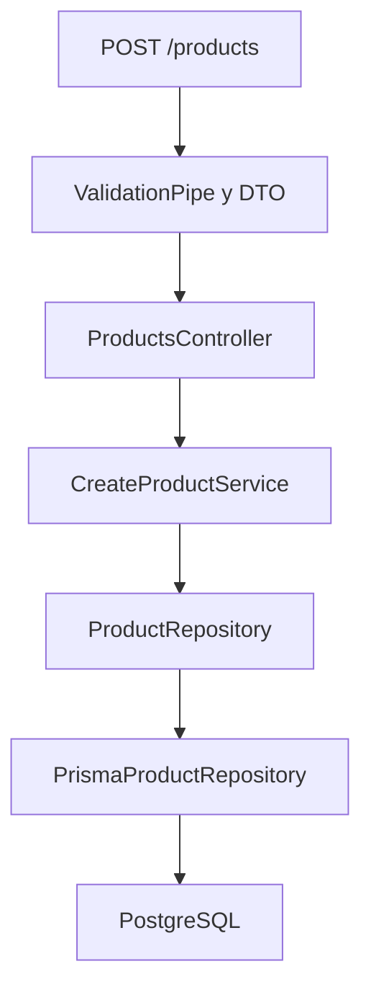
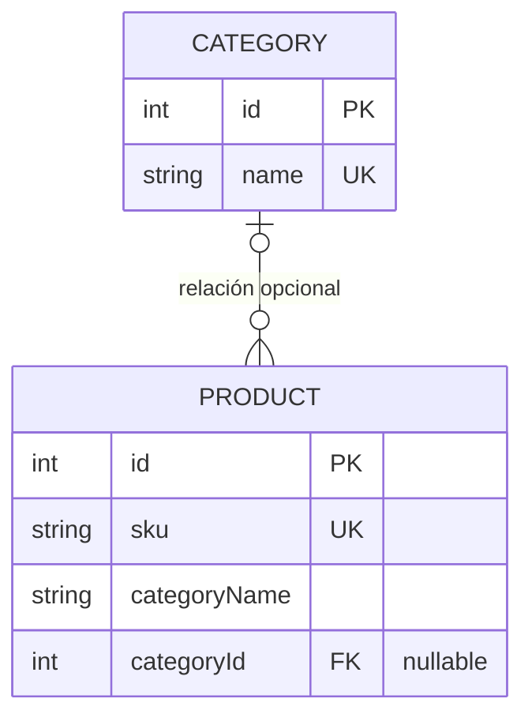
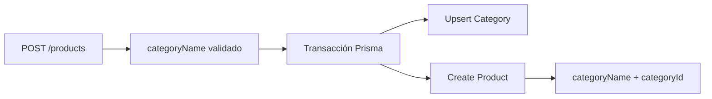

# Inventario Migraciones

Infraestructura inicial de una API de inventario con NestJS, PostgreSQL y Prisma.

## Requisitos

- Node.js 22 o posterior
- npm
- Docker con Docker Compose

## Instalación

```bash
npm install
```

## Variables de entorno

Copia `.env.example` como `.env` y ajusta exclusivamente los valores locales. `.env` está ignorado por Git.

## Iniciar PostgreSQL

```bash
docker compose up -d
docker compose ps
```

## Iniciar la API

Genera el cliente Prisma e inicia la aplicación:

```bash
npm run prisma:generate
npm run start:dev
```

## Verificar salud

Con PostgreSQL y la API activos:

```bash
curl http://localhost:3000/health
```

La respuesta esperada es:

```json
{"status":"ok","database":"connected"}
```

## Modelo inicial Product

La primera versión del dominio almacena `sku`, nombre, descripción opcional, precio, existencias y `categoryName` como texto. PostgreSQL exige SKU único, precio positivo, stock no negativo y los campos obligatorios definidos en el esquema.

## Migraciones de desarrollo

Crea una migración sin aplicarla para poder revisar primero su SQL:

```bash
npx prisma migrate dev --name nombre_de_la_migracion --create-only
```

Después de revisar el archivo generado, aplica las migraciones pendientes:

```bash
npm run prisma:migrate
```

Comprueba su estado con:

```bash
npm run prisma:status
```

Una migración aplicada es inmutable: no debe editarse, eliminarse ni renombrarse. Este proyecto no utiliza `prisma db push`.

## Datos iniciales

Ejecuta el seed reproducible e idempotente con:

```bash
npm run prisma:seed
```

## Crear un producto

`POST /products` valida y transforma la entrada antes de persistirla. `categoryName` continúa siendo texto porque la relación con `Category` se incorporará mediante migraciones posteriores.

```http
POST /products
Content-Type: application/json

{
  "sku": "FER-003",
  "name": "Taladro eléctrico",
  "description": "Taladro de 500 W",
  "price": 450.75,
  "stock": 8,
  "categoryName": "Herramientas"
}
```

Una creación correcta responde `201 Created`:

```json
{
  "id": 17,
  "sku": "FER-003",
  "name": "Taladro eléctrico",
  "description": "Taladro de 500 W",
  "price": "450.75",
  "stock": 8,
  "categoryName": "Herramientas",
  "createdAt": "2026-09-19T23:17:49.133Z",
  "updatedAt": "2026-09-19T23:17:49.133Z"
}
```

Los errores utilizan una estructura uniforme. Por ejemplo, un SKU repetido responde `409` con `PRODUCT_SKU_CONFLICT`, y los datos inválidos responden `400` con `VALIDATION_ERROR`:

```json
{
  "statusCode": 409,
  "code": "PRODUCT_SKU_CONFLICT",
  "message": "Ya existe un producto con el SKU FER-003",
  "path": "/products",
  "timestamp": "2026-09-19T23:17:49.221Z"
}
```

## Recorrido de la solicitud



- El DTO transforma y valida la entrada.
- El controlador delega la operación sin consultar la base de datos.
- El servicio coordina el caso de uso y comprueba el SKU mediante el puerto.
- El puerto desacopla la aplicación de Prisma.
- El repositorio Prisma persiste, convierte el resultado y traduce errores conocidos.
- El filtro global convierte errores de validación, aplicación e inesperados en respuestas HTTP seguras.

## Pruebas

Ejecuta todas las pruebas unitarias y e2e con:

```bash
npm test -- --runInBand
```

Compila el proyecto con:

```bash
npm run build
```

## Fase expandir: Category

La migración `20260919232628_expand_add_category_relation` implementa únicamente la fase **expandir** de la estrategia `Expandir → Migrar datos → Contraer`.



Durante esta fase coexisten:

```text
categoryName: campo anterior, obligatorio y todavía activo
categoryId: nueva relación opcional
```

`Category` incorpora un nombre único y una relación opcional con productos. La migración conserva los datos porque crea una tabla nueva y agrega una columna nullable; no elimina columnas, no modifica productos y no obliga a los registros existentes a tener una categoría relacionada.

Al finalizar inicialmente la fase expandir, `Category` permanecía vacía y los productos conservaban `categoryId = null`. La fase siguiente realizó el backfill antes de hacer obligatoria la relación o retirar el campo anterior.

## Fase migrar datos y escritura dual

La migración `20260920054829_backfill_product_categories` completa la fase **Migrar datos** sin contraer todavía el esquema. Su SQL:

- crea una categoría por cada `TRIM(categoryName)` distinto y no vacío;
- reutiliza categorías existentes mediante `ON CONFLICT DO NOTHING`;
- asigna el `categoryId` correspondiente a productos todavía no relacionados;
- aborta si algún producto queda con `categoryId = null`.

`categoryName` continúa presente y la relación sigue siendo nullable a nivel de esquema para mantener compatibilidad durante la transición.

Las nuevas escrituras mantienen ambos campos sincronizados:



El `upsert` de la categoría y la creación del producto ocurren en una sola transacción. Si la creación falla, la categoría tampoco queda persistida. El seed utiliza el mismo principio: crea o reutiliza categorías, conserva `categoryName`, asigna `categoryId` y actualiza productos mediante `upsert` por SKU sin borrar registros adicionales.

Para verificar el estado después del backfill:

```sql
SELECT COUNT(*) FROM "Product" WHERE "categoryId" IS NULL;
SELECT p."sku", p."categoryName", c."name"
FROM "Product" p
JOIN "Category" c ON c."id" = p."categoryId";
```

### Despliegue seguro

Después de desplegar previamente la expansión, el orden para un entorno no orientado al desarrollo es:

1. Desplegar una versión compatible con escritura dual.
2. Aplicar el backfill con `npx prisma migrate deploy`.
3. Confirmar que no existan productos con `categoryId = null`.
4. Mantener temporalmente `categoryName` y `categoryId`.
5. Contraer el esquema en una versión posterior.

`prisma migrate dev` crea y aplica migraciones durante el desarrollo. `prisma migrate deploy` aplica migraciones ya versionadas en entornos desplegados. En producción no deben utilizarse `prisma migrate dev`, `prisma db push` ni `prisma migrate reset`.
