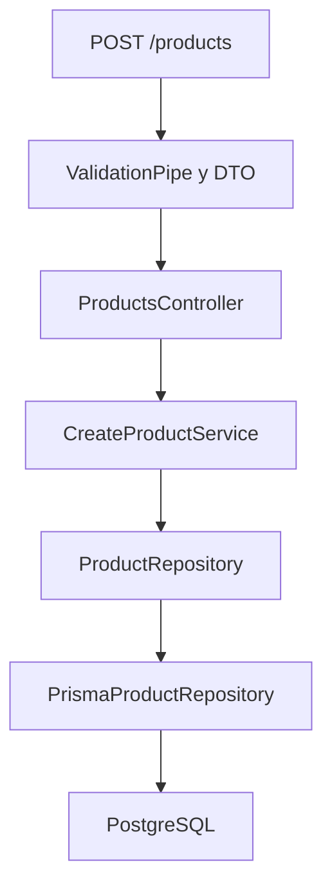
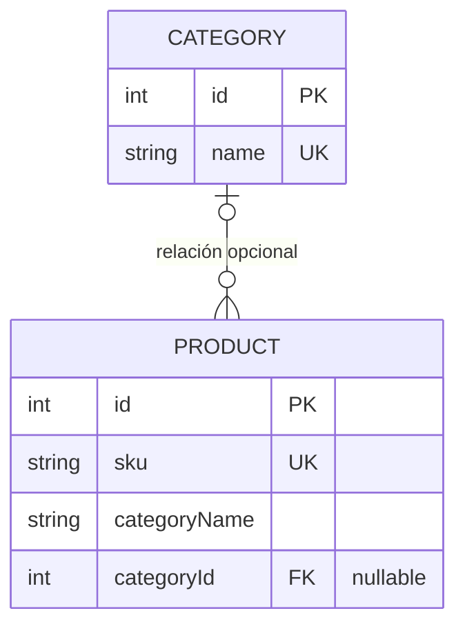
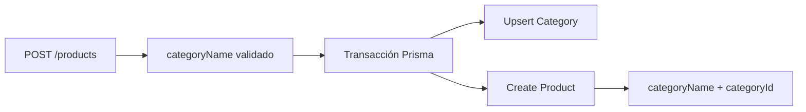
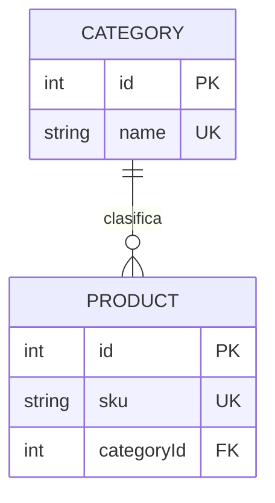

# Inventario Migraciones

## Estado actual

La API de inventario registra categorías y productos y permite consultarlos,
aplicando unicidad de SKU y categoría, precio positivo, stock entre 0 y 1000 y
relaciones obligatorias con categorías existentes. El proyecto usa NestJS 11,
TypeScript, Prisma 6, PostgreSQL 17, Docker Compose, Vitest y Testcontainers.

### Requisitos y configuración

Se requiere Node.js 22 LTS, npm y Docker Desktop activo con soporte para
contenedores Linux. Copia `.env.example` a `.env` y reemplaza únicamente los
valores locales de muestra, manteniendo `DATABASE_URL` sincronizada con el
usuario, contraseña, base y puerto de Compose (5433). Nunca publiques `.env` ni
contraseñas reales.

```powershell
npm ci
Copy-Item .env.example .env
docker compose up -d postgres
npm run prisma:validate
npm run prisma:generate
npx prisma migrate deploy
npm run start:dev
```

Las migraciones versionadas se aplican con `prisma migrate deploy`; no uses
`prisma migrate reset` ni `prisma db push`. La API expone `POST /categories`,
`GET /categories`, `POST /products`, `GET /products`, `GET /products/:id` y
`GET /health`. Las respuestas inválidas son 400, los recursos inexistentes 404
y los SKU o nombres duplicados 409.

### Pruebas y entornos de base de datos

```bash
npm run test:unit
npm run test:integration
```

Las unitarias se ejecutan una vez con Vitest y repositorios falsos, sin PostgreSQL.
Las de integración crean una base PostgreSQL efímera exclusivamente con
Testcontainers, aplican las migraciones, usan los repositorios Prisma reales y
eliminan el contenedor al finalizar. No utilizan `localhost:5433`, `.env` ni los
datos de desarrollo. Docker Desktop debe estar activo para ejecutarlas localmente.

El workflow `.github/workflows/ci.yml` se ejecuta en `push` y `pull_request` con
dos jobs independientes, `unit-tests` e `integration-tests`. Ambos usan
`ubuntu-latest`, Node 22, caché npm, `npm ci` y Prisma Client generado; cada uno
ejecuta su suite una sola vez. El job de integración no declara un servicio
PostgreSQL: Testcontainers crea la base temporal dentro del runner.

El bloque 7 fue publicado en `origin/main`. Consulta
[docs/BLOQUE_07.md](docs/BLOQUE_07.md) para el estado y las comprobaciones
realizadas.

La evidencia final actualizada está en
[docs/BLOQUE_FINAL_EVIDENCIAS.md](docs/BLOQUE_FINAL_EVIDENCIAS.md).

Infraestructura inicial de una API de inventario con NestJS, PostgreSQL y Prisma.

El contenido que sigue conserva notas históricas de los bloques anteriores. Para
el contrato vigente, toma como referencia esta sección y los documentos
`docs/BLOQUE_01.md` a `docs/BLOQUE_07.md`; algunos ejemplos antiguos describen
las etapas de migración antes de la contracción final.

## Estado actual: bloque 5

Están disponibles `POST /categories`, `GET /categories`, `POST /products`,
`GET /products` y `GET /products/:id`. El registro de productos exige una
categoría previamente registrada: enviar `categoryId` o, por compatibilidad,
`categoryName`, nunca ambos. Ya no se crean categorías implícitamente.
Consulta [contratos, archivos y evidencia HTTP real](docs/BLOQUE_03.md).
Las secciones de fases de migración más abajo conservan el historial del proyecto
y sus ejemplos de contratos anteriores.

Las [pruebas unitarias del bloque 4](docs/BLOQUE_04.md) funcionan sin PostgreSQL.
La [integración del bloque 5](docs/BLOQUE_05.md) crea y elimina PostgreSQL temporal
con Testcontainers. Requiere Docker Desktop activo y no usa la base de desarrollo.

## Bloque actual: estructura, Vitest y definición de flujos

Consulta [el alcance, los flujos y las reglas de negocio](docs/BLOQUE_01.md).
Las secciones de base de datos y migraciones de este README describen trabajo
preexistente; no es necesario ejecutarlas para este bloque.

## Requisitos

- Node.js 22 o posterior
- npm
- Docker con Docker Compose

## Instalación

```bash
npm install
```

## Variables de entorno

Copia `.env.example` como `.env` y ajusta exclusivamente los valores locales. `.env` está ignorado por Git.

## Iniciar PostgreSQL

```bash
docker compose up -d
docker compose ps
```

## Iniciar la API

Genera el cliente Prisma e inicia la aplicación:

```bash
npm run prisma:generate
npm run start:dev
```

## Verificar salud

Con PostgreSQL y la API activos:

```bash
curl http://localhost:3000/health
```

La respuesta esperada es:

```json
{"status":"ok","database":"connected"}
```

## Modelo inicial Product

La primera versión del dominio almacena `sku`, nombre, descripción opcional, precio, existencias y `categoryName` como texto. PostgreSQL exige SKU único, precio positivo, stock no negativo y los campos obligatorios definidos en el esquema.

## Migraciones de desarrollo

Crea una migración sin aplicarla para poder revisar primero su SQL:

```bash
npx prisma migrate dev --name nombre_de_la_migracion --create-only
```

Después de revisar el archivo generado, aplica las migraciones pendientes:

```bash
npm run prisma:migrate
```

Comprueba su estado con:

```bash
npm run prisma:status
```

Una migración aplicada es inmutable: no debe editarse, eliminarse ni renombrarse. Este proyecto no utiliza `prisma db push`.

## Datos iniciales

Ejecuta el seed reproducible e idempotente con:

```bash
npm run prisma:seed
```

## Crear un producto

`POST /products` valida y transforma la entrada antes de persistirla. `categoryName` continúa siendo texto porque la relación con `Category` se incorporará mediante migraciones posteriores.

```http
POST /products
Content-Type: application/json

{
  "sku": "FER-003",
  "name": "Taladro eléctrico",
  "description": "Taladro de 500 W",
  "price": 450.75,
  "stock": 8,
  "categoryName": "Herramientas"
}
```

Una creación correcta responde `201 Created`:

```json
{
  "id": 17,
  "sku": "FER-003",
  "name": "Taladro eléctrico",
  "description": "Taladro de 500 W",
  "price": "450.75",
  "stock": 8,
  "categoryName": "Herramientas",
  "createdAt": "2026-09-19T23:17:49.133Z",
  "updatedAt": "2026-09-19T23:17:49.133Z"
}
```

Los errores utilizan una estructura uniforme. Por ejemplo, un SKU repetido responde `409` con `PRODUCT_SKU_CONFLICT`, y los datos inválidos responden `400` con `VALIDATION_ERROR`:

```json
{
  "statusCode": 409,
  "code": "PRODUCT_SKU_CONFLICT",
  "message": "Ya existe un producto con el SKU FER-003",
  "path": "/products",
  "timestamp": "2026-09-19T23:17:49.221Z"
}
```

## Recorrido de la solicitud



- El DTO transforma y valida la entrada.
- El controlador delega la operación sin consultar la base de datos.
- El servicio coordina el caso de uso y comprueba el SKU mediante el puerto.
- El puerto desacopla la aplicación de Prisma.
- El repositorio Prisma persiste, convierte el resultado y traduce errores conocidos.
- El filtro global convierte errores de validación, aplicación e inesperados en respuestas HTTP seguras.

## Pruebas

Ejecuta las pruebas unitarias existentes con Vitest:

```bash
npm run test:unit
```

`npm test` ejecuta la misma selección. `npm run test:integration` ejecuta una vez
la suite independiente con PostgreSQL temporal de Testcontainers: inicia el
contenedor, aplica migraciones, prueba los repositorios reales y lo elimina.
Docker Desktop debe estar activo; no requiere `.env` ni PostgreSQL de desarrollo.
`npm run test:watch` utiliza Vitest para las pruebas unitarias.
La suite de la base de verificación externa se conserva separada mediante
`npm run test:integration:legacy`, con sus requisitos previos de conexión.
Las pruebas heredadas unitarias y e2e siguen disponibles con
`npm run test:legacy -- --runInBand`; `npm run test:cov` conserva la cobertura Jest.

Compila el proyecto con:

```bash
npm run build
```

## Fase expandir: Category

La migración `20260919232628_expand_add_category_relation` implementa únicamente la fase **expandir** de la estrategia `Expandir → Migrar datos → Contraer`.



Durante esta fase coexisten:

```text
categoryName: campo anterior, obligatorio y todavía activo
categoryId: nueva relación opcional
```

`Category` incorpora un nombre único y una relación opcional con productos. La migración conserva los datos porque crea una tabla nueva y agrega una columna nullable; no elimina columnas, no modifica productos y no obliga a los registros existentes a tener una categoría relacionada.

Al finalizar inicialmente la fase expandir, `Category` permanecía vacía y los productos conservaban `categoryId = null`. La fase siguiente realizó el backfill antes de hacer obligatoria la relación o retirar el campo anterior.

## Fase migrar datos y escritura dual

La migración `20260920054829_backfill_product_categories` completa la fase **Migrar datos** sin contraer todavía el esquema. Su SQL:

- crea una categoría por cada `TRIM(categoryName)` distinto y no vacío;
- reutiliza categorías existentes mediante `ON CONFLICT DO NOTHING`;
- asigna el `categoryId` correspondiente a productos todavía no relacionados;
- aborta si algún producto queda con `categoryId = null`.

`categoryName` continúa presente y la relación sigue siendo nullable a nivel de esquema para mantener compatibilidad durante la transición.

Las nuevas escrituras mantienen ambos campos sincronizados:



El `upsert` de la categoría y la creación del producto ocurren en una sola transacción. Si la creación falla, la categoría tampoco queda persistida. El seed utiliza el mismo principio: crea o reutiliza categorías, conserva `categoryName`, asigna `categoryId` y actualiza productos mediante `upsert` por SKU sin borrar registros adicionales.

Para verificar el estado después del backfill:

```sql
SELECT COUNT(*) FROM "Product" WHERE "categoryId" IS NULL;
SELECT p."sku", p."categoryName", c."name"
FROM "Product" p
JOIN "Category" c ON c."id" = p."categoryId";
```

### Despliegue seguro

Después de desplegar previamente la expansión, el orden para un entorno no orientado al desarrollo es:

1. Desplegar una versión compatible con escritura dual.
2. Aplicar el backfill con `npx prisma migrate deploy`.
3. Confirmar que no existan productos con `categoryId = null`.
4. Mantener temporalmente `categoryName` y `categoryId`.
5. Contraer el esquema en una versión posterior.

`prisma migrate dev` crea y aplica migraciones durante el desarrollo. `prisma migrate deploy` aplica migraciones ya versionadas en entornos desplegados. En producción no deben utilizarse `prisma migrate dev`, `prisma db push` ni `prisma migrate reset`.

## Fase contraer: modelo relacional final

La migración `20260920060800_contract_product_category_relation` completa la estrategia **Expandir → Migrar datos → Contraer**.



`Product.categoryId` es ahora obligatorio y la columna heredada `Product.categoryName` fue eliminada. Esta eliminación es segura porque el backfill previo relacionó todos los productos y el nombre vive en `Category.name`.

El contrato HTTP no cambió: `POST /products` continúa recibiendo `categoryName`. El repositorio crea o reutiliza la categoría, almacena únicamente `categoryId` en `Product`, incluye la relación Prisma y devuelve `category.name` como `categoryName` en la respuesta pública.

Comprobaciones útiles:

```sql
SELECT column_name, is_nullable
FROM information_schema.columns
WHERE table_name = 'Product'
  AND column_name IN ('categoryId', 'categoryName');

SELECT p."sku", p."categoryId", c."name"
FROM "Product" p
JOIN "Category" c ON c."id" = p."categoryId";
```

### Despliegue controlado de la contracción

La contracción es incompatible con versiones antiguas que todavía escriban `Product.categoryName`. En un entorno no orientado al desarrollo:

1. Confirmar que la versión con escritura dual está desplegada.
2. Confirmar cero `categoryId` nulos.
3. Crear un respaldo.
4. Activar una ventana de mantenimiento o detener escrituras.
5. Aplicar el historial con `npx prisma migrate deploy`.
6. Desplegar la versión que usa únicamente la relación.
7. Ejecutar pruebas de humo.
8. Reactivar el tráfico.

En producción no deben utilizarse `prisma migrate dev`, `prisma db push` ni `prisma migrate reset`.

## Reconstrucción desde una base vacía

El historial completo puede reconstruir el esquema final en una instancia PostgreSQL nueva sin modificar la base principal.

### Desarrollo

Durante el desarrollo, `prisma migrate dev` permite crear y probar migraciones nuevas:

```bash
npm run prisma:migrate
```

Este comando es interactivo y no debe utilizarse en producción.

### Despliegue o reconstrucción

En entornos no orientados al desarrollo se utiliza:

```bash
npx prisma migrate deploy
```

`migrate deploy` no genera migraciones ni solicita decisiones interactivas; aplica las migraciones pendientes que ya están versionadas.

La verificación automatizada requiere Docker, Node.js, npm, PowerShell y un archivo local `.env.verify` creado a partir de `.env.verify.example`. El archivo local está ignorado por Git.

Ejecuta:

```powershell
Copy-Item .env.verify.example .env.verify
npm run verify:fresh-db
```

El script:

- levanta PostgreSQL temporal mediante `compose.verify.yaml` en el proyecto `inventory-history-verification`;
- exige que la base empiece sin tablas;
- configura `DATABASE_URL` sólo para su proceso;
- ejecuta `prisma migrate deploy` y `prisma migrate status`;
- ejecuta el seed dos veces y compara conteos;
- comprueba relaciones, duplicados, compilación y pruebas;
- no imprime secretos, no modifica `.env` y no toca el volumen principal.

El script deja la instancia temporal activa para comprobaciones HTTP manuales en el puerto 3001. Para limpiarla de forma segura:

```powershell
docker compose --env-file .env.verify -f compose.verify.yaml -p inventory-history-verification down
```

No uses `-v` contra el proyecto principal. La alternativa manual utiliza los mismos archivos: levantar el proyecto temporal, confirmar cero tablas, definir `DATABASE_URL` sólo en el proceso, ejecutar `npx prisma migrate deploy`, ejecutar dos veces `npm run prisma:seed`, probar la API en otro puerto y limpiar exclusivamente `inventory-history-verification`.

Nunca utilices `prisma db push` o `prisma migrate reset` para reconstruir o desplegar este proyecto.
